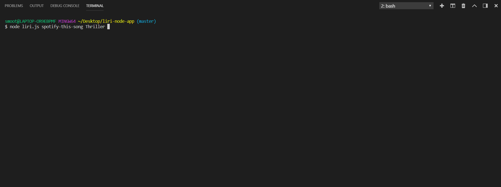
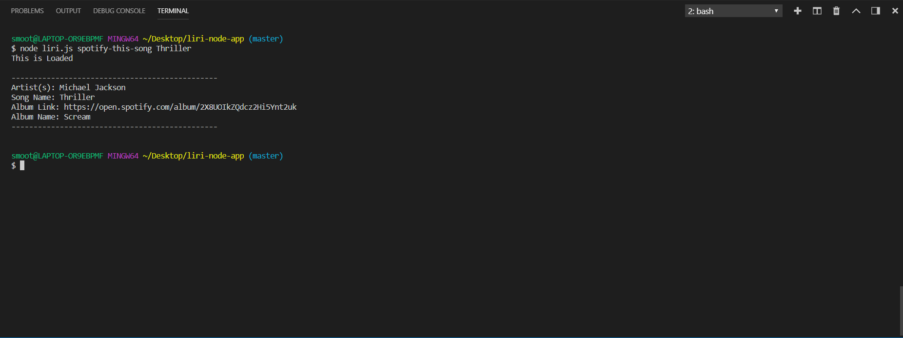
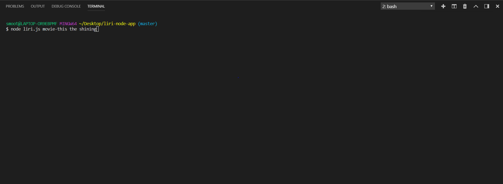
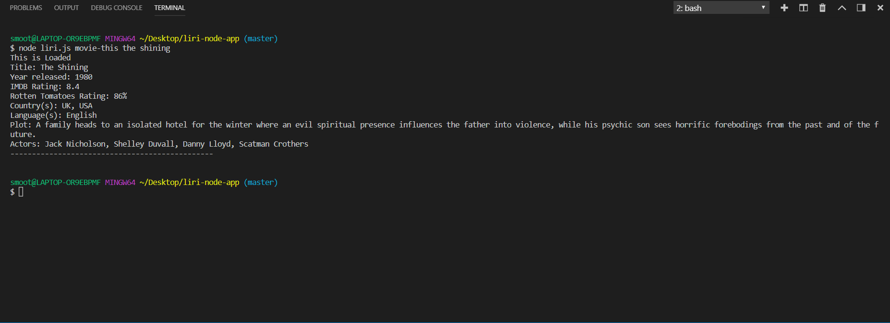
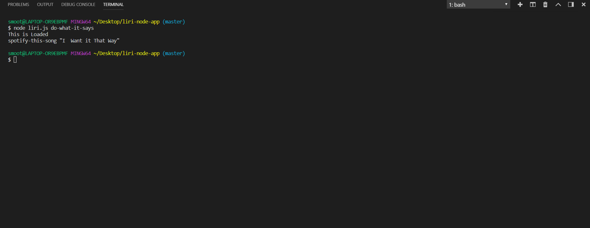

# liri-node-app
Liri is a Language Interpretation and Recognition Interface. LIRI takes in your user input and helps you learn more about one of the following topics!

* Search for songs

* Search for movies 

# How to get started using liri

### First you will need to install the node packages being used in application by:

* opening terminal and typing,"  npm i " no quotes. Which will install the packages needed from the package.json files. 

* then after the packages are installed you can navigate to the liri.js folder in terminal and use one of the following commands to search up what you want: spotify-this-song, movie-this.

* followed by an song, movie, or concert you would like to attend. 

## Example for Songs:

## Example for Movies:

#### If you use the command do-what-it-says the application will grab the information from the random.txt file and present it to you. In the future I would like to make so that the app can append said information into a new file automatically. 

One more feature I will be working on is a way to get information from the Bandsintown API on your favorite artist and for LIRI to show you when that artist comes to town!

